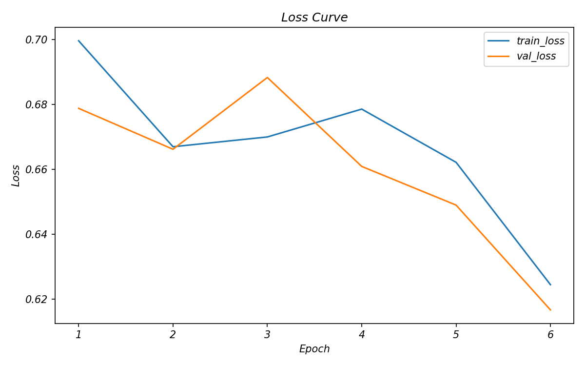
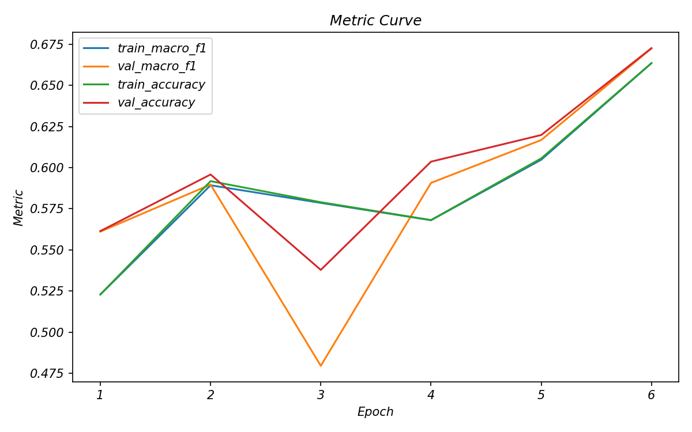
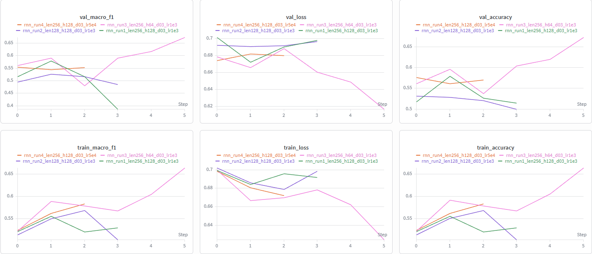

# CSC4007 — Lab 3 Analysis Report (RNN + W&B)

## 1. Thông tin sinh viên
- Họ và tên: Trần Trường Giang
- Mã sinh viên: 1671040009 
- Lớp: KHMT 16-01
- Repo GitHub: https://github.com/FIT-DNU-CS-16-01/csc4007-lab3-trggiang0704
- W&B project: https://wandb.ai/giangtit1007-dainam-vietnam/csc4007-lab3-rnn
- Tên run tốt nhất: rnn_run3_len256_h64_d03_lr1e3

## 2. Mục tiêu thí nghiệm

Lab 3 khác Lab 2 ở chỗ Lab 2 sử dụng các mô hình machine learning truyền thống như Logistic Regression hoặc Linear SVM với biểu diễn BoW/TF-IDF, còn Lab 3 chuyển sang mô hình chuỗi với Embedding + RNN. BoW/TF-IDF biểu diễn văn bản như tập hợp từ/cụm từ và không mô hình hóa tốt thứ tự từ, trong khi RNN đọc review theo chuỗi token nên có khả năng học thông tin ngữ cảnh theo thứ tự. Việc chuyển sang mô hình chuỗi là cần thiết vì bài toán sentiment classification trên IMDB có nhiều hiện tượng như phủ định, câu có chuyển ý bằng “but/however”, review dài và mixed sentiment. Em kỳ vọng RNN có thể cải thiện khả năng hiểu thứ tự từ, nhận biết ngữ cảnh trước-sau và xử lý tốt hơn các trường hợp mà TF-IDF dễ nhầm như “not good”, “starts well but becomes terrible”.

## 3. Sequence audit

Dựa trên `outputs/logs/sequence_audit.md` của cấu hình tốt nhất Run 3:

- `n_train`: 20000
- `vocab_size`: 20000
- `max_len`: 256
- `orig_len_median`: 196.0
- `orig_len_p95`: 665.0
- `truncation_rate`: 0.3475
- `unk_rate`: 0.0238
- `avg_pad_ratio`: 0.2537

1. Review trong IMDB có độ dài khá lớn và phân bố không đều. Độ dài trung vị là `196.0` token, trong khi p95 lên tới `665.0` token. Điều này cho thấy phần lớn review có độ dài vừa phải nhưng vẫn tồn tại nhiều review rất dài. Với bài toán sentiment classification, review dài thường chứa nhiều ý trái chiều, ví dụ đầu review khen nhưng cuối review chê, nên mô hình cần giữ được đủ ngữ cảnh để phân loại chính xác.

2. `max_len = 256` là lựa chọn tương đối hợp lý nhưng chưa hoàn toàn bao phủ toàn bộ review. Vì median length là `196.0`, nhiều review trung bình có thể được giữ khá đầy đủ. Tuy nhiên, do p95 = `665.0`, vẫn có nhiều review dài hơn 256 token. Điều này dẫn tới `truncation_rate = 0.3475`, tức khoảng `34.75%` review bị cắt ngắn. Nếu phần bị cắt chứa kết luận hoặc đoạn đảo chiều sentiment, mô hình có thể dự đoán sai.

3. Tỉ lệ token ngoài từ điển thấp. `unk_rate = 0.0238`, tức khoảng `2.38%` token bị thay bằng `<UNK>`. Đây là mức không quá cao, cho thấy `vocab_size = 20000` bao phủ tương đối tốt các từ phổ biến trong tập IMDB. Điều này giúp mô hình học embedding ổn định hơn vì phần lớn token thật vẫn được giữ lại thay vì bị gom vào token không xác định.

4. Lượng padding ở mức chấp nhận được. `avg_pad_ratio = 0.2537`, tức trung bình khoảng `25.37%` vị trí trong chuỗi là padding. Padding không mang thông tin nội dung, nhưng mức này không quá cao so với Run 2. Khi so với Run 2 có `max_len = 128`, tuy padding thấp hơn nhưng `truncation_rate` tăng lên `83.45%`, làm mất quá nhiều nội dung review. Vì vậy, với IMDB, `max_len = 256` là lựa chọn cân bằng hơn giữa giữ nội dung và hạn chế padding.

## 4. Thiết lập mô hình và huấn luyện

Cấu hình tốt nhất được chọn là Run 3:

- vocab_size: 20000
- max_len: 256
- embed_dim: 128
- hidden_dim: 64
- batch_size: 64
- epochs: 6
- learning rate: 0.001
- dropout: 0.3
- seed: 42
- early stopping patience: 2
- wandb_mode: online

Em chọn cấu hình Run 3 vì đây là cấu hình có kết quả tốt nhất trong các lần chạy RNN. Run 3 đạt `val_macro_f1 = 0.6724` và `test_macro_f1 = 0.6709`, cao hơn Run 1, Run 2 và Run 4. So với Run 1, Run 3 giữ nguyên `max_len = 256` nhưng giảm `hidden_dim` từ 128 xuống 64, giúp mô hình nhỏ hơn và học ổn định hơn. Run 2 giảm `max_len` xuống 128 nhưng làm `truncation_rate` tăng lên `83.45%`, khiến nhiều review bị cắt mất thông tin quan trọng. Run 4 giảm learning rate xuống `5e-4` nhưng không cải thiện rõ rệt. Vì vậy, Run 3 là cấu hình hợp lý nhất để dùng làm kết quả chính trong báo cáo.

## 5. Baseline ML vs RNN

Bảng dưới đây so sánh baseline ML tốt nhất của Lab 2 với cấu hình RNN tốt nhất của Lab 3.

| Mô hình | Accuracy | Macro-F1 | Ghi chú |
|---|---:|---:|---|
| Baseline ML (Lab 2) | 0.9098 | 0.9098 | TF-IDF + Linear SVM, baseline tốt nhất của Lab 2 |
| RNN (Lab 3) | 0.6710 | 0.6709 | Run 3: token sequence + Embedding + RNN |

### Nhận xét

RNN chưa tốt hơn baseline ML của Lab 2. Baseline tốt nhất của Lab 2 là TF-IDF + Linear SVM, đạt `test accuracy = 0.9098` và `test macro-F1 = 0.9098`, trong khi cấu hình RNN tốt nhất chỉ đạt `test accuracy = 0.6710` và `test macro-F1 = 0.6709`. Như vậy, RNN thấp hơn baseline khoảng `0.2389` macro-F1, tương đương gần `23.89` điểm phần trăm. Nguyên nhân hợp lý là TF-IDF + Linear SVM rất phù hợp với dữ liệu văn bản dạng sparse và khai thác tốt các từ/cụm từ cảm xúc trong IMDB. RNN có lợi thế về thứ tự từ, nhưng mô hình RNN đơn giản trong Lab 3 phải học embedding và quan hệ tuần tự từ đầu, trong khi review IMDB khá dài và một phần bị cắt bởi `max_len = 256`. Vai trò của thứ tự từ vẫn quan trọng ở các trường hợp như phủ định, mixed sentiment hoặc câu có “but/however”, nhưng cấu hình RNN hiện tại chưa đủ mạnh để khai thác lợi thế đó tốt hơn baseline truyền thống.

## 6. Learning curves và W&B

Project W&B: `csc4007-lab3-rnn`

Các run đã so sánh:

| Run | max_len | hidden_dim | lr | Val Macro-F1 | Test Macro-F1 | Nhận xét |
|---|---:|---:|---:|---:|---:|---|
| Run 1 | 256 | 128 | 1e-3 | 0.5791 | 0.5771 | Cấu hình đầu tiên, kết quả còn thấp |
| Run 2 | 128 | 128 | 1e-3 | 0.5268 | 0.5321 | Kém nhất do cắt ngắn quá nhiều review |
| Run 3 | 256 | 64 | 1e-3 | 0.6724 | 0.6709 | Tốt nhất, học ổn định hơn |
| Run 4 | 256 | 128 | 5e-4 | 0.5545 | 0.5611 | Giảm learning rate nhưng chưa cải thiện |

Epoch tốt nhất của Run 3 là epoch 6, vì tại epoch này `val_macro_f1` đạt giá trị cao nhất là `0.6724`, đồng thời `test_macro_f1` đạt `0.6709`. Với Run 3, chưa có dấu hiệu overfitting nghiêm trọng vì train và validation không tách xa quá mạnh; validation loss có xu hướng giảm về cuối và validation macro-F1 tăng lên mức tốt nhất ở epoch cuối. W&B giúp quan sát rõ diễn biến `train_loss`, `val_loss`, `train_macro_f1`, `val_macro_f1`, `train_accuracy` và `val_accuracy` theo từng epoch, thay vì chỉ nhìn các dòng log rời rạc trong terminal. W&B cũng giúp so sánh nhiều run trên cùng dashboard, từ đó thấy rõ Run 3 tốt hơn các run còn lại do giữ `max_len = 256` nhưng giảm `hidden_dim = 64`, giúp mô hình học ổn định và tổng quát hóa tốt hơn.

## 7. Error analysis (ít nhất 10 mẫu sai)

Phân tích lỗi được thực hiện trên cấu hình tốt nhất Run 3. Theo `outputs/error_analysis/error_analysis_summary.md`, mô hình RNN dự đoán sai tổng cộng `8226` mẫu trên tập test. Các nhóm lỗi chính gồm:

| Nhóm lỗi | Số lượng lỗi | Tỉ lệ xấp xỉ |
|---|---:|---:|
| negation | 6933 | 84.28% |
| mixed_sentiment | 793 | 9.64% |
| other | 289 | 3.51% |
| long_review | 211 | 2.57% |

### Tổng hợp lỗi

1. Nhóm lỗi lớn nhất là phủ định hoặc đảo chiều ý nghĩa, chiếm `6933` lỗi. Mô hình thường bị nhầm khi review có các từ/cụm như `not`, `cannot`, `never`, `however`, `but`, hoặc khi câu mở đầu tích cực nhưng phần sau lại phủ định/đảo chiều sentiment.

2. Nhóm mixed sentiment có `793` lỗi. Đây là các review có cả khen và chê, ví dụ khen diễn viên hoặc một vài cảnh nhưng kết luận chung là phim tệ. RNN đơn giản có thể chưa xác định được đâu là ý chính quyết định nhãn cuối cùng.

3. Nhóm review dài có `211` lỗi. Với `max_len = 256`, vẫn có khoảng `34.75%` review bị cắt ngắn. Nếu phần kết luận nằm ở cuối review bị cắt, mô hình sẽ mất thông tin quan trọng để phân loại sentiment.

4. Một số lỗi thuộc nhóm sarcasm/irony hoặc từ khóa gây hiểu nhầm. Mô hình có thể thấy các từ tích cực như `amazing`, `incredible`, `funniest`, nhưng không hiểu rằng người viết đang dùng theo nghĩa mỉa mai hoặc trong ngữ cảnh tiêu cực.

5. Một số mẫu sai có confidence cao, cho thấy mô hình không chỉ dự đoán sai mà còn rất tự tin. Điều này phản ánh mô hình có xu hướng dựa vào tín hiệu bề mặt thay vì hiểu ngữ cảnh sâu.

### Bảng ghi nhận lỗi

| ID | True label | Pred label | Vì sao sai? | Hướng cải thiện |
|---:|---|---|---|---|
| 0 | negative | positive | Review có từ tích cực như “funniest”, nhưng phần sau nói không thể cho nhiều sao hơn và hài hước là vô tình. Mô hình bị đánh lừa bởi tín hiệu tích cực ban đầu. | Xử lý negation/chuyển ý; dùng LSTM/GRU hoặc attention để hiểu ngữ cảnh sau “however”. |
| 1 | negative | positive | Review nhắc tới “excellent reviews” và kỳ vọng tích cực, nhưng thực tế là thất vọng và phim bị chê dull. | Tăng khả năng hiểu toàn đoạn; dùng mô hình contextual để phân biệt kỳ vọng và đánh giá thật. |
| 7 | negative | positive | Câu mở đầu “I LOVE Italian horror films” tích cực, nhưng sau đó chuyển hướng bằng “However” và chê phim nghiệp dư. | Xử lý các từ nối đảo chiều như `however`, `but`; dùng attention. |
| 79 | positive | negative | Review là positive nhưng có nhắc tới “flaws”, mô hình có thể quá nhạy với từ tiêu cực. | Huấn luyện thêm với mixed sentiment; giúp mô hình hiểu “flaws” không nhất thiết làm sentiment chung thành negative. |
| 2 | negative | positive | Review có một số tín hiệu như “acceptable”, “few laughs”, nhưng ý tổng thể là chê cốt truyện sao chép và pathetic. | Dùng mô hình hiểu ngữ cảnh tổng thể; tăng khả năng xác định câu kết luận. |
| 38 | negative | positive | Review nói phim “pretty awful” nhưng cũng có vài cảnh creepy và hài vô tình, gây mixed sentiment. | Dùng attention hoặc mô hình pretrained để phân biệt nhận xét chính và phụ. |
| 309 | positive | negative | Review positive nhưng có các từ thuộc nội dung phim như mystery/dead/murder, dễ bị hiểu nhầm là sentiment tiêu cực. | Phân biệt từ mô tả nội dung phim với từ thể hiện cảm xúc. |
| 3 | negative | positive | Review dài và có giọng mỉa mai; mô hình có thể bị ảnh hưởng bởi cấu trúc “if you love...” ở đầu câu. | Tăng `max_len`, dùng BiLSTM/GRU hoặc chia review dài thành nhiều đoạn. |
| 253 | negative | positive | Review bắt đầu bằng nhận xét tích cực như “starts well”, “witty”, nhưng nửa sau chuyển sang tiêu cực. | Giữ đủ phần cuối review; tăng `max_len` hoặc dùng cơ chế tổng hợp đoạn. |
| 35 | negative | positive | Cụm “What a stinker!!!” và “written by a computer” mang ý chê, nhưng mô hình có thể không hiểu thành ngữ/cách nói cường điệu. | Bổ sung dữ liệu lỗi kiểu sarcasm/irony; dùng mô hình contextual. |
| 119 | negative | positive | Câu “this movie is incredible” có vẻ tích cực nhưng thực tế là mỉa mai, sau đó chê “story is totally silly”. | Cải thiện nhận diện sarcasm; dùng pretrained language model hoặc attention. |

### Nhận xét

Phân tích lỗi cho thấy RNN tốt nhất của Lab 3 vẫn mắc `8226` lỗi trên tập test. Nhóm lỗi lớn nhất là `negation`, chiếm `6933` lỗi, tương đương khoảng `84.28%`, cho thấy mô hình chưa xử lý tốt các cấu trúc phủ định hoặc đảo chiều ý nghĩa như `not`, `cannot`, `however`, `but`. Nhóm `mixed_sentiment` cũng đáng chú ý với `793` lỗi, vì nhiều review IMDB có cả khen và chê trong cùng một văn bản. Ngoài ra, một số lỗi đến từ review dài, trong khi `max_len = 256` vẫn làm cắt khoảng `34.75%` review ở cấu hình Run 3. Các mẫu sai có confidence cao cho thấy mô hình thường bị đánh lừa bởi từ khóa bề mặt như `amazing`, `excellent`, `funniest` hoặc các từ tiêu cực trong phần mô tả nội dung phim. Để cải thiện, nên thử LSTM/GRU, attention hoặc Transformer, đồng thời cân nhắc tăng `max_len` và xử lý riêng các cấu trúc phủ định.

## 8. Bài học rút ra

Qua Lab 3, em thấy rằng chuyển từ TF-IDF/LogReg sang Embedding + RNN không tự động làm kết quả tốt hơn. RNN có ưu điểm là xử lý văn bản theo chuỗi token và có khả năng học thứ tự từ, nhưng RNN đơn giản vẫn gặp nhiều hạn chế khi review dài, có phủ định, mixed sentiment hoặc sarcasm. Sequence length có vai trò rất quan trọng: nếu `max_len` quá ngắn như 128 thì nhiều review bị cắt, còn nếu quá dài thì padding và chi phí tính toán tăng. Validation set giúp chọn cấu hình tốt hơn thay vì chỉ nhìn train loss, vì một mô hình giảm train loss chưa chắc cải thiện validation macro-F1. Learning curves cho thấy Run 3 học ổn định hơn các run khác, trong khi Run 1, Run 2 và Run 4 nhanh chóng bão hòa hoặc không cải thiện validation. W&B rất hữu ích vì giúp theo dõi trực quan nhiều metric theo epoch và so sánh nhiều run trong cùng một dashboard. Bài học chính là cần đánh giá đồng thời dữ liệu, cách biểu diễn đầu vào, sequence length, kiến trúc mô hình và validation metric trước khi kết luận mô hình nào tốt hơn.

## 9. Tự đánh giá theo rubric

Em tự đánh giá sơ bộ theo `reports/rubric.md` như sau:

| Tiêu chí | Tự đánh giá | Minh chứng |
|---|---|---|
| Chạy được mô hình RNN trên IMDB | Đạt | Đã chạy Run 1, Run 2, Run 3, Run 4 trên dataset IMDB |
| Có sử dụng W&B | Đạt | Có project `csc4007-lab3-rnn`, log các metric train/validation theo epoch |
| Có sequence audit | Đạt | Đã phân tích `orig_len_median`, `orig_len_p95`, `truncation_rate`, `unk_rate`, `avg_pad_ratio` |
| Có chạy ít nhất 2 cấu hình RNN | Đạt | Đã chạy 4 run, trong đó Run 3 tốt nhất |
| Có so sánh với baseline Lab 2 | Đạt | So sánh RNN Run 3 với TF-IDF + Linear SVM và Logistic Regression |
| Có phân tích learning curves | Đạt | Đã nhận xét loss curve, metric curve và W&B dashboard |
| Có error analysis ít nhất 10 mẫu sai | Đạt | Đã chọn và phân tích 11 mẫu sai theo các nhóm lỗi |
| Có rút ra bài học | Đạt | Đã nêu vai trò của sequence length, validation set, W&B và hạn chế của RNN |
| Mức hoàn thành tổng thể | Tốt | Đáp ứng các yêu cầu chính của Lab 3, tuy nhiên kết quả RNN vẫn thấp hơn baseline ML |

Kết luận tự đánh giá: Em đã hoàn thành các yêu cầu chính của Lab 3, bao gồm chạy RNN, log W&B, thử nhiều cấu hình, so sánh với baseline Lab 2, đọc learning curves và phân tích lỗi. Điểm cần cải thiện là mô hình RNN hiện tại vẫn thấp hơn baseline ML, nên trong hướng phát triển tiếp theo cần thử LSTM/GRU, attention, pretrained embeddings hoặc Transformer để khai thác tốt hơn ngữ cảnh và thứ tự từ.